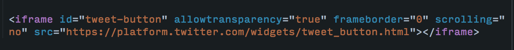

#iframe

*The HTML Inline Frame Element*

Within the browser, each *window*, new *tab*, or *iframe* would have what is viewed as it's own *browser context*,  which is created by the browser, and as such, each new document(or new link) that you surf, would be stored and presented to users in this browsing context. The *browsing context* holds the session history and sets the page as the active document.

There is a top-level *browsing context*, which would have no parents and is usually the *browser* window and then there is the *parent* browsing context which holds the embedded content. An `iframe` represents a nested element within the page which also has a browsing context, but rather than it being the parent top-level element, it is an inline element that has a *parent* browsing context in relation to it's embedded content. 

Prior to the HTML5 specification, the `<iframe>` element needed to be embedded in the now deprecated `<frameset>` element and the `<frameset>` was the `<iframe>`'s parent *browsing context*. Also, an `<iframe>` couldn't exist outside of the `<frameset>` nor could the `body` element of a page or the `<frameset>` be in the same page. With the HTML5 specification, the `<iframe>` is no longer  embedded within a `<frameset>` and can be placed anywhere in the page where it's parent element accepts embedded content.

An *iframe* is commonly used for when a website needs to include external content such as a Google map or a Youtube video. Both of these websites have an embedded feature to easily include the `src` content into an *iframe*.

Another use for an *iframe* may be as a popup, which would display the contents of the popup inline embedded in an *iframe* instead of through the conventional *window.open* method.

Also, a button may open a part of functionality of a web application embedded inside an *iframe*. For example, Twitter's tweet button opens up an *iframe* with the options to tweet.

##Syntax

```
<iframe value=""></iframe>
```

The `<\iframe>` closing tag is required. 

An `<iframe>` can be placed in the page wherever embedded content is accepted.


##Attributes

###align

***Deprecated and Obsolete as of HTML5***
___

###allowfullscreen

* **true**: If the *true* value is set,  the `<iframe>` can be set in full screen mode with the *Element.requestFullSreen()* method within the respective Javascript. If the *true* value isn't set, there is no way to set the `<iframe>` into full screen mode.

___

###mozallowfullscreen & webkitallowfullscreen

***Deprecated***

The attributes ***mozallowfullscreen*** and ***webkitallowfullscreen*** both were browser-specific methods to allow full screen mode and are now deprecated. Instead  setting the ***allowfullscreen*** attribute is the recommended method. 
___

###height

The value in pixels or percentages from the *height* attribute is now set in HTML5 with the CSS *height* property either within the `<iframe`> tag or the CSS stylesheet.

For example:

```
<iframe height="400px"></iframe>
```
```
div {
	height: 400px;
}
```
___

###marginheight

***HTML 4 only implimentation***

Prior to the HTML5 *height* method, the standard method for setting the height of an `<iframe>` was with the *marginheight* attribute. The pixel value was the distance  of the height of the content plus the top and bottom margins.
___

###width

The value in pixels or percentages from the *width* attribute is now set in HTML5 with the CSS *width* property either within the `<iframe>` tag or the CSS stylesheet.

For example:

```
<iframe width="50%"></iframe>
```
```
div {
	width: 50%;
}
```
___

###marginwidth

***HTML 4 only implimentation***

Prior to the HTML5 *width* method, the standard method for setting the width of an `<iframe>` was with the *marginwidth* attribute. The pixel value was the distance  of the width of the content plus the left and right margins.
___

###frameborder

***HTML 4 only***

Has two values:

* **1**: Default value. Tells ther browser to draw a border between the `<iframe>` being worked on and every other *iframe* in the Document.

* **0**: If given, the value tells the browser **Not** to draw a border between the `<iframe>` being worked on and every other *iframe* in the Document.
___

###longdesc

***HTML 4 only***

Displays a long description of the *iframe* content. For non-visual browsers the simplest way to display a brief description of what is in the `<iframe>` is with the `title` attribute, though if a longer description is needed to provide further information or purpose of the *iframe* content, the *longdesc* attribute can be used. 

The attribute value is usually a file which contains the extra descriptive text, usually in the form of a .txt file.

Eventhough available, there is no browser support for this feature as there is really no practical use for this feature as with any browser which displays an *iframe*, the visual content effective displays the purpose of the `<iframe>`.
###name 

The *name* attribute in the `<iframe>` is the name of the embedded browsing context or frame.
The *name* value can be the name from the *target* attribute's value. The value can be grabbed from the *target* attribute  of the `<a>` or `<form>` elements or the value of the *formtarget* attribute specified in the `<input>` or `<button>` element. 

As such, when any of the related elements are acted upon, such as when being "clicked" or "submitted", the `<iframe>` will be displayed relative to the *target* browsing context.  

The *browsing context* grabbed from the *target* can be one of the follow values:

* **_self**: Load the response into the same browsing context as the current one. In other words, displayed in the present page. This is the default value if the target attribute isn't specified.

* **_blank**: Load the response into a new browsing context. A new page is loaded and the `<iframe>` is displayed in it.

* **_parent**: Load the response into the  parent of the current browsing context. If there isn't one, the response is the same as *_self*. 
For example, where the top-level browsing context of the **Document** would be the browser window, if there is an `<iframe>` nested within another element, the element the `<iframe>` is nested in would be considered the parent of the current browsing context of the `<iframe>`.

* **top**: Load the frame into the top level parentless ancestor of the current one. If there is no parent, the response is the same as *_self*.
The top level parentless element is usually the *browser* window.

___

###referrerpolicy

```
<iframe referrerpolicy="no-referrer|no-referrer-when-downgrade|origin|
origin-when-cross-origin|unsafe-url"></iframe>
```
***An experimental API not to be used in production code***

The *referrerpolicy* is in reference to the **HTTP referrer**. 
When visiting a webpage, the **referrer** is a HTTP header field which identifies the address of the original page from which the link was followed. The Referer header is an optional component of the HTTP request when sent to the server.  

One of the following string values below represent the *referrer policy* and will determine what *referrer* action will be taken when an `<iframe>` is opened into a new window.

* **no-referrer**: The HTTP *Referer* header of the original website will not be sent.

* **no-referrer-when-downgrade**: The HTTP *Referer* header will only be sent if the original website of the `<iframe>` was a secure TLS(HTTPS) website.
This is the default behaviour if no other is specified.

* **origin**: The HTTP *Referer* is that of the original page from which the `<iframe>` was embedded within.

* **origin-when-cross-origin**: When navigating to another origin outside of the `<iframe>`'s parent browser context, the other origin is limited to the the web address of that origin and will not have an HTTP referer from the original web page.

* **unsafe-url**: The `<iframe>` will reference to the  original website and it's path, sending a HTTP Referer header with the value from the original website. This policy, as stated is unsafe, and will leak origins and paths from protected resources to insecure origins. **Use with caution**.

___

###scrolling

```
<iframe scrolling="auto|yes|no"></iframe>
```
***HTML 4 Only. Not supported in HTML5, use CSS instead with the `overflow` property***

Specifies whether or not to display a scrollbar in the `<iframe>`.

Values are:

* **auto**: This is the default value. Scrollbars appear if needed.

* **yes**: Scrollbars are always shown even if the content does't overflow and they are not needed.

* **no**: Scrollbars are never shown even if they are needed. The content is essentially displayed like set in CSS with `overflow: hidden;`

___
###sandbox

```
<iframe sandbox="allow-forms allow-modals allow-orientation-lock 
allow-pointer-lock allow-popups allow-popups-to-escape-sandbox 
allow-presentation allow-same-origin allow-scripts allow-top-origin">
</iframe>
```
***HTML5 ONLY***

The *sandbox* attribute enables additional restrictions on the content that can be displayed in the `<iframe>`. Any and all values can be included. If an empty string, all values are included or the included values are in a space-separated list. If the value is not included in the list the operation is not allowed.

The addition of the *sandbox* attribute greatly improves security from  embedded content taking advantage of priviliges that weren't granted to it as the embedded content simply won't have access to the functionality in the first place.

Below are the values:

* **allow-forms**: With this value included, within the browsing context of the `<iframe>` forms can be submitted.

* **allow-modals**: The opening of modal windows is allowed within the browsing context of the `<iframe>`. A modal window is a graphical control element which opens within the main window, for example the top-level browser context(main page) from which the `<iframe>` orginated. The modal window disables the main window and needs to be acted upon before control returns to the main window. An example would be a dialog box that requests an action before the next step in an application can take place. For example, such as if the software license agreement was read before a software download can take place.

* **allow-orientation-lock**: With this value present, within the `<iframe>` browsing context, the ability to lock the screen orientation is disabled.

* **allow-pointer-lock**: Within the browsing context of the `<iframe>` the Pointer Lock API is allowed. The Pointer Lock API affects the typical behavior of mouse movements. Where the mouse movement is dictated more by the element or application it is being used on, rather than the browser window itself. For example, the mouse movement can be locked to a map embedded in an `<iframe>` element and the mouse movement actions such as scrolling or dragging dictated by the maps parameters.

*  **allow-popups**: This value allows popups, such as from the window.open() method in javascript.

* **allow-popups-to-escape-sandbox**: This value allows that when a window is opened from a *sandboxed* `<iframe>`, the sandbox values are not passed on to the new window. This can be useful, for example, when a popup is opened from a third party advertising, the same sandbox restrictions on the opened page will not apply.

* **allow-presentation**:

* **allow-same-origin**: Allows the content to be treated as if it was from it's original origin. 

* **allow-scripts**: Allows the page loaded into the `<iframe>` to run Javascript to deal with the respective user interaction.

* **allow-top-navigation**: This value allows the document to break out of the `<iframe>` navigating to the top-level window, the browser window.

___


###scr 

The *src* is the URL source of the page to be embedded within the `<iframe>`.

For example: an *iframe* of a google map.

```
<iframe src="https://www.google.com/maps/@45.5229316,-122.6423862,15z"></iframe>
```

Or, for  example Twitter's tweet button.

```
<iframe src="https://platform.twitter.com/widgets/tweet_button.html"
        style="border: 0; width:130px; height:20px;"></iframe>
```

___

###srcdoc

***HTML5 ONLY***

The *srcdoc* attribute is the content in which the `<iframe>` is to contain, and if included, overrides the `src` attribute. The functionality of the *scrdoc* can be of use when a content author wants to use *sandbox* and have it remain secure eventhough it may be non-functional in legacy browsers. 

For example: 

```
<iframe src="data:...untrusted content" sandbox /> 
<- Secure in modern browsers, insecure in legacy browsers with no sandbox support
```

```
<iframe srcdoc="...untrusted content"   sandbox /> 
<- Secure in modern browsers, secure (though non-functional) in legacy browsers
```

## Examples

#### Embedding a Google map 

One of the most common uses of an iframe is for the purpose of displaying a map to the user relevant to the service of the website. The most common way to grab an embedded *iframe* is with [google maps](https://maps.google.com) embed feature from the sites dropdown menu.


For example,  a website for getting information on local yoga studios may show an embedded map of the city with the locations pinned so the user knows which may be closest to them.

The HTML to create the embedded map:


###### Linking to original map(image above)

A link can be created to go to the source website from whence the *iframe's* embedded map came.


#### Creating a Twitter frame 

Often websites will have the funcion of the user being able to make Twitter tweets directly from inside the website. This is done through a Tweet button, which when clicked opens an *iframe* with the application embedded in it.

The HTML 	to create the Twitter features:



Which displays the below button:


And the below *iframe* is displayed for the user:


