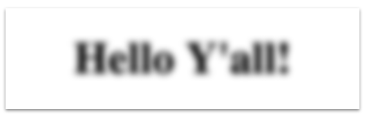
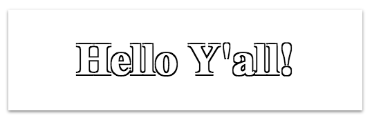
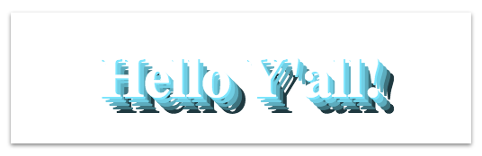

#text-shadow

*CSS property for creating shadowing affect on text*.

The CSS `text-shadow` property is used for creating shadowing affects on any text on the page, with options of changing the shadows positioning, thickness, blurring affect and any CSS compatible color.

Text shadows can be used to add style to text to give it emphasis or contrast within the page. Often, the text within a logo, heading, a navigation button will have text-shadowing to draw attention to the text and help it stand out from other text in the page. Often, their is design considerations on how the text-color, text-shadow, and the background color can be used to bring out the desired visual affects.

The shadows distance is set relative to the edge of the text. 
There can be multiple text-shadows set on any given element, with the first specified shadow on top. The shadow requires specific offset values with optional color and blur radius values.


##Syntax

The optional color can be at the beginning or ending of the value list, but the offsets and optional blur radius maintain the specific order with the blur radius after the offsets.

The values follow the order of: 
```
offset-x | offset-y | blur-radius | color; 

text-shadow: 1px 1px 2px grey;
```
or 
```
color | offset-x | offset-y | blur-radius;

text-shadow: grey 1px 1px 2px;
```

If the `color` and `blur-radius` are ommitted, the default values are used.

```
offset-x | offset-y

text-shadow: 1px 1px;
```

Though, it is recommended to specify a color to maintain consistency accross browsers.


### Values

#### Color

The color can be in an hexidecimal, rgb(), rgba(), hsl(), hsla(), or named color. 
___
#### Offsets

##### Offset-x

The *offset-x* value specifies the distance from the text edge of the text in the horizontal axis. 

 

If the value is negative, the shadow is placed on the left of the text, otherwise the default value is to the right of the text.

##### Offset-y

The *offset-y* value specifies the distance from the text edge  of the text in the vertical axis.


If the value is negative, the shadow is above the text, otherwise the default value is below the text.


___
#### Blur-radius

The length of the blur from the edge of the text, outward. The higher the value, the wider and lighter the value. 

## Examples

#### Bottom right shadow.

With positive offsets and a blur-radius we get a shadow evenly on the left and bottom.

`h1 { color: #fff; text-shadow: 2px 2px 2px #000; }`


#### Top left shadow 

With negative offsets the shadow is placed on the top and left positions from the text.

`h1 { text-shadow: -2px -2px 2px #000; }`


#### Even blurred affect

If there is a `0` value given to both offsets, the shadow is placed evenly behind the text and then a blur-radius can be given to make an evenly-spread shadow affect. Also, giving the text and the color the same color can make the text "pop", giving it a raised affect.

`h1 { color: #fff; text-shadow: 0 0 2px #000; }`

 

#### Far away shadow 

If the *offset-x* and *offset-y* values are given a large value with no blur-radius, a far-away shadow affect can be created.

`h1 { text-shadow: 30px 10px 0 #fff; }`


#### Blurred text 

Setting the font-color to transparent and having no offsets and a blur-radius creates a blurred text affect.

`h1 { color: transparent; text-shadow: 0 0 3px #000; }`



#### Outline shadow 

An outline affect can be created by layering the box-shadow, adding a shadow around each side of the text.

`h1 { text-shadow: -1px -1px 0 #000, 1px -1px 0 #000, 1px 1px 0 #000, -1px 1px 0 #000; }`


 
#### Multi-color shadow

You can layer many colors by increasing the offsets on each layer. 

Remember the layers are displayed from how they are written in the CSS with the left value on top of the next right value.

`h1 { text-shadow: 1px 1px 0 #77E5FF, 3px 3px 0 #6CCEE5, 5px 5px 0 #5AACBF, 7px 7px 0 #3C737F, 9px 9px 0 #1E3940; }` 



##Special Notes

###### Lengths Values

The common units of measure for the *offsets* and  *blur-radius* are:

* `px` pixels

* `%` percentages

* `em` relative to the font size

* `rem` relative to the root font size.

###### Thickness of text 

For some browsers, the text shadow property may thin the font very slightly.

